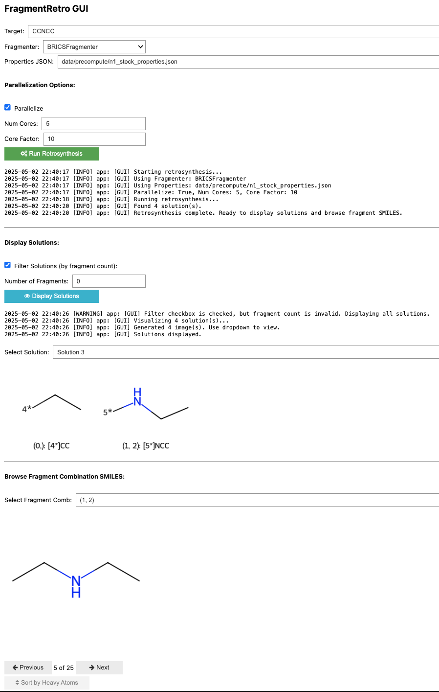

# FragmentRetro GUI Tutorial

This tutorial guides you through the use of the FragmentRetro Graphical User Interface (GUI). Here's a screenshot:

## GUI Components

Here's a breakdown of the different sections and controls in the GUI:

1. **Target SMILES:**
    * **Field:** Enter the SMILES string of the target molecule you want to perform retrosynthesis on.
    * *Example:* `CCNCC`

2. **Fragmenter Selection:**
    * **Dropdown:** Choose the fragmentation algorithm to use (e.g., `BRICSFragmenter`).

3. **Properties JSON:**
    * **Field:** Specify the path to the JSON file containing precomputed fragment properties.
    * *Example:* `data/precompute/n1_stock_properties.json`

4. **Parallelization Options:**
    * **Parallelize Checkbox:** Enable or disable parallel processing for substructure matching.
    * **Num Cores:** If parallelization is enabled, specify the number of CPU cores to use.
    * **Core Factor:** If the product of Num Cores and Core Factor is greater than the number of building blocks to match, no parallelization will occur. This is a tradeoff for parallel overhead.

5. **Run Retrosynthesis:**
    * **Button:** Click this button to start the retrosynthesis process based on the configured parameters.

6. **Log Output:**
    * **Text Area:** Displays real-time logs and status updates during the retrosynthesis process. Shows information like the fragmenter used, properties file, parallelization settings, number of solutions found, and completion status.
    * **Logger Suppression:** To suppress log messages, use loggers to control the verbosity of the output.

7. **Display Solutions:**
    * **Filter Solutions Checkbox:** Enable filtering of displayed solutions based on the number of fragments.
    * **Number of Fragments:** If filtering is enabled, enter the desired number of fragments to filter by. A value of `0` or invalid input usually displays all solutions.
    * **Display Solutions Button:** Click to update the solution display based on the filter settings.
    * **Select Solution Dropdown:** Choose a specific retrosynthesis solution to view its details. *Example:* `Solution 3`

8. **Selected Solution Visualization:**
    * **Image Area:** This area displays the chemical structures of the fragments corresponding to the selected solution, with each fragment accompanied by its associated connection points (e.g., `4*`, `5*`).
    * **Text:** This section displays the SMILES strings and combination indices for the fragments in the selected solution. *Example:* `(0,): [4*]CC`, `(1, 2): [5*]NCC`

9. **Browse Building Blocks:**
    * **Select Fragment Comb:** This option allows you to select the indices of fragments (comma-separated) to visualize the fragment combinations of a chosen solution. *Example:* `(1, 2)`
    * **Image Area:** This area displays the building blocks that have substructure matches with the chosen fragments (fragment combinations).

10. **Pagination Controls (for Building Blocks):**
    * **Previous/Next Buttons:** These buttons enable navigation through different possible building block matches if there are many.
    * **Counter:** This counter shows the current building block being viewed out of the total. *Example:* `5 of 25`

11. **Sorting Options:**
    * **Sort by Heavy Atoms Checkbox:** This option allows you to sort the visualized building blocks by the number of heavy atoms.

This covers the main elements of the FragmentRetro GUI. Use these controls to input your target molecule, configure the parameters, run the retrosynthesis, and explore the resulting fragmentation solutions.
